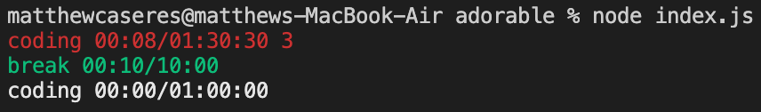
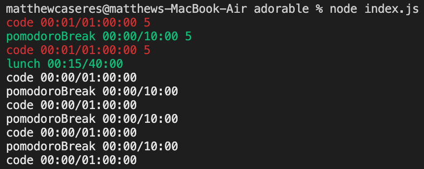
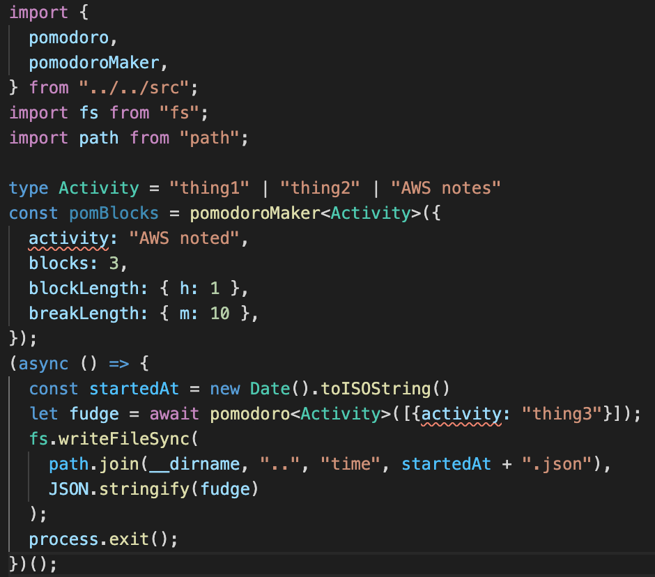

# pomodoroble

## About

This is a programmable timer that returns detailed user data in JSON format. 

Traditionally you might enter some data in a CLI prompt. With this timer you import the timer function and write a script with custom logic for generating your configuration and saving the data.

You can leverage TypeScript to enforce data quality and improve the user experience.

## Simple timers

### Make a file

Start a new Node.js project, install pomodoroble, and make a file `index.js` with the following contents.

```js
var {pomodoro} = require("pomodoroble");

(async () => {
  let logs = await pomodoro([
    {activity: "coding", h: 1, m: 30, s: 30},
    {activity: "break", m: 10, finishUnder: true},
    {activity: "coding", h: 1},
  ]);
  console.log(logs)
  process.exit()
})();
```

### Run the code

The `pomodoro` method runs a timer. Run `node index.js` to execute the code above.



### Interactions

In the first coding block I coded for 8 seconds. I then pressed `3` on my keyboard to indicate that my focus was 3 on a scale from 0 to 9. **To move the timer from one interval to the next you press a key 0-9**, which is recorded as the `focus` field in the recorded JSON.

Once the required time passes the timer goes from red to green. When the `finishUnder` attribute is true, the timer starts at green and turns red when you go over time.

You can escape the process without recording by pressing `ctrl+c`

### Recording data

When you enter a number for the final timer it finishes `await`ing your call to `pomodoro`, logs the logs, and exits.

The numbers you entered are now your `focus` ratings. The `start` and `end` field are ISO strings that record the start and end time of the activity interval.

I recommend saving these off to somewhere (file system, server) in a format that is convenient (JSON, CSV, etc.).

```js
[
  {
    activity: 'coding',
    start: 2021-03-03T23:02:18.820Z,
    end: 2021-03-03T23:02:26.963Z,
    focus: 3,
    goalSeconds: 5430,
    loggedSeconds: 8.143
  },
  {
    activity: 'break',
    finishUnder: true,
    start: 2021-03-03T23:02:26.963Z,
    end: 2021-03-03T23:14:36.559Z,
    focus: 4,
    goalSeconds: 600,
    loggedSeconds: 729.596
  },
  {
    activity: 'coding',
    start: 2021-03-03T23:14:36.559Z,
    end: 2021-03-03T23:14:41.960Z,
    focus: 5,
    goalSeconds: 3600,
    loggedSeconds: 5.401
  }
]
```

## pomodoroMaker

This is a utility function to create patterns of timers.

```js
var { pomodoro, pomodoroMaker } = require("pomodoroble");
//6 1hr intervals of code
const intervals = pomodoroMaker({
  activity: "code",
  blocks: 6,
  blockLength: { h: 1 },
  breakLength: { m: 10 },
});
// Give ourselves a lunch
intervals[3] = { activity: "lunch", m: 40, finishUnder: true };

(async () => {
  let logs = await pomodoro(intervals);
  console.log(logs);
  process.exit();
})();
```



## TypeScript

You can see how I'm currently using the software in `usage/scripts`. At time of writing it looks roughly like this:



Both `pomodoro` and `pomodoroMaker` take a generic that will type the `activity` parameter. This provides both data validation (see image above) and auto-completion.


